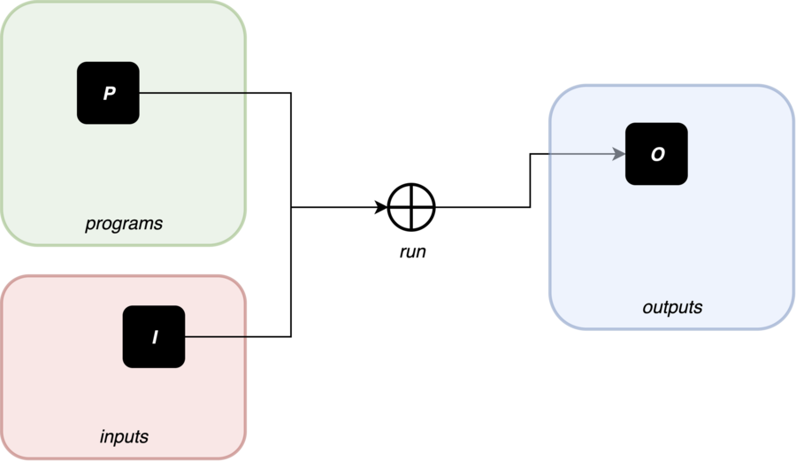
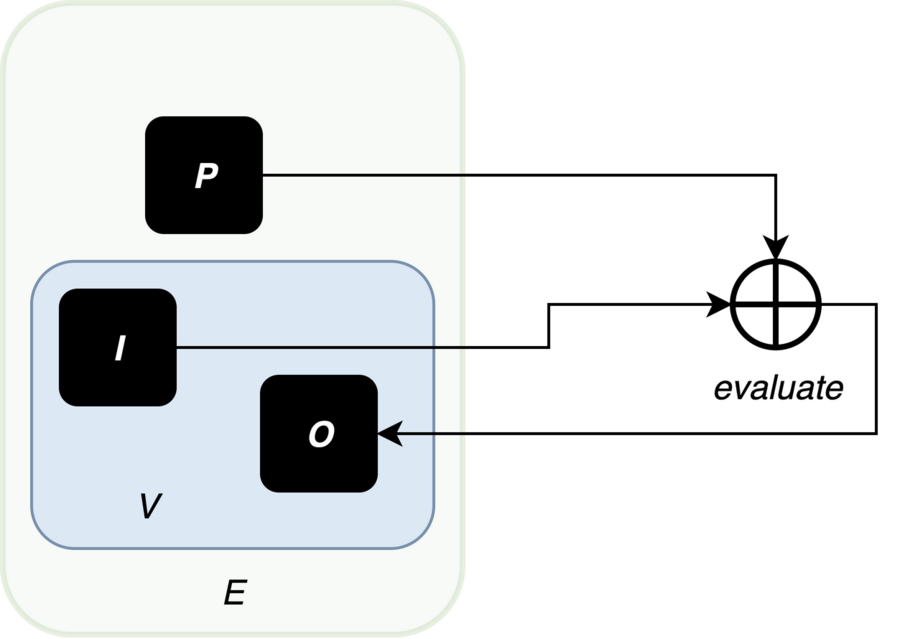

= Partial evaluation
Meinte Boersma
:sectnums:

Published: July  18th, 2023

The idea of partial evaluationfootnote:[Wikipedia: https://en.wikipedia.org/wiki/Partial_evaluation] is that you "`run`" a program against input data that's only partially known.
This should not result in the usual output, but rather a reduced version of that same program.
In other words: the source program has been _specialized_ for the partial input it has been given to it.
The specialized version of the program is reduced, so it should be simpler and shorter.

Being able to perform partial evaluation has a number of uses/use cases:

[horizontal]
Optimization:: The specialized version runs faster.
Reasoning:: The specialized version is easier to reason about without resorting to a debugger.

[NOTE]
====
One situation where I've used this has to do with the EU Digital COVID Certificatefootnote:[https://commission.europa.eu/strategy-and-policy/coronavirus-response/safe-covid-19-vaccines-europeans/eu-digital-covid-certificate_en].
Countries were able to formulate validation rules to determine whether they could let someone with a DCC come across their border.
These rules were "`little programs`" defined in a very small "`programming language`", which made both the language and the rules very portable.
Those rules grew to be fairly complex over time, which made it non-trivial to e.g. determine which country was accepting which vaccines.
To help with that, I used partial evaluation to derive such information automatically.
For more details: https://github.com/ehn-dcc-development/eu-dcc-business-rules-analysis
====

In this blog post, I'll demonstrate the idea of partial evaluation practically.
To (be able to) do that, I'll cook up a very simple "`model/test`" programming language.

[IMPORTANT]
====
All the TypeScript code in this blog is available here: https://github.com/dslmeinte/blogs/content/partial-evaluation/src/.
The code in the first section is contained in the file `section-1.ts`, while the code for the second section has been spread out across multiple files in the directory `section-2`.
The code relies on Denofootnote:[https://deno.land/] for its {Java|Type}Script runtime.
====

First, I'll go back to what "`running a program`" means in our case:

In this diagram, _P_ stands for the **p**rogram to execute, _I_ for the **i**nput data, and _O_ for the **o**utput data.
The program is written in some (combination of) programming language(s).
The &CirclePlus; symbol in the center represents the "`runner`": the thing that runs a given program against given data, to immediately produce an output.
This may be an interpreter, or a combination of a compilation phase, and an execution phase.
This only models "`batch programs`", so long-running, interactive programs are not included in this model.

All this means that the "`runner`" is essentially an _evaluation function_ `evaluate` which maps the arguments _P_ and _I_ to _O_.
Let's denote the space of all programs as _E_ (for **E**xpressions -- I'll explain later), and the space of all input data _and_ output data as _V_ (for **V**alues).
Mathematically speaking, `evaluate` is a function mapping _E &times; V &rarr; V_.

It's quite natural and logical that any value has a representation in _E_ as well, so I can assume that _V_ is a subset of _E_.
So, the diagram should really be as follows:

The evaluation function is __endomorphic__footnote:[Wikipedia: https://en.wikipedia.org/wiki/Endomorphism] in its first argument: a pair of an expression and data turns into an expression again.
Mathematicians probably don't consider this _true_ endomorphism, but I don't care about no stinkin' mathematiciansfootnote:[I'm (a recovering) one myself, so I'm allowed to say that.] `;)`

== A simple programming language

To make things concrete, I'll define a simple programming language, and mold it into a shape that's suitable for doing partial evaluation.

=== The language's specification

The language has only three operators:

[horizontal]
``@``_<index>_:: Evaluates to the value at the given _<index>_ number value of the array that makes up the input data, or `undefined` if there's no array element of that index or if the input is not an array.
The _<index>_ operand must be a `number`, and even a non-negative integer to stand a chance of being meaningful.
(A serious language would allow _<index>_ to be an expression (so an `Expr`), and would have some way of specifying the data it operates on, rather than always the whole input data.)
_<left>_ `<` _<right>_:: Evaluates to the boolean value indicating whether the _<left>_ operand is numerically smaller than the _<right>_ operand.
Both operands of this binary operator are ``Expr``s.
Both must evaluate to ``number``s, otherwise `undefined` is returned.
Both operands are always evaluated _before_ the type check and comparison are executed.
`if` _<guard>_ `then` _<then>_ `else` _<else>_:: Evaluates to the evaluation of the _<then>_ expression when the _<guard>_ expression evaluates to a JavaScript "`truthy`" valuefootnote:[https://developer.mozilla.org/en-US/docs/Glossary/Truthy], and to the evaluation of the _<else>_ expression otherwise.
(Note that the only "`falsy`" literal values are `0`, `NaN`, `false`, and `undefined`.
The empty array `[]` is truthy.)

Note that evaluation always succeeds, and never throws an error.
If that weren't the case, the _evaluate_ function wouldn't be a true function, but a _partial_ function.
It also means that it doesn't matter in what order sub-expressions (in the form of operands) are evaluated.

In addition to these operators, the language has the following _literals_:

[horizontal]
booleans:: `true`, `false`
numbers:: any instance of JavaScript's `number` type
undefined:: `undefined`
arrays:: any array whose elements are valid literals again

I can take _V_ -- the set of all possible in- and output values -- to equal these literals.
I leave it as an exercise to the reader to verify that the _evaluate_ function is sufficiently well-defined by the details above.
In particular, it really is a function _E &times; V &rarr; V_.

All of these language constructs happen to be _expressions_: they can be run on their own, without causing side effects, and they always produce a value.
If any program consists of a single expression, it makes sense to denote the space of all programs with _E_ for **e**xpressions.

To write down programs -- or rather: expressions -- I won't be using the "`readable`" concrete syntax shown above, though.
Instead, I'll use JSON to represent programs concretely.
More precisely: the concrete syntax of this language is a subset of the JSON syntax.
This is a choice of convenience:

* I don't have to implement a special parser for the language -- I can just use any JSON parser.
* The literals are already JSON.

=== The language's implementation

With the specification above I can start implementing the _evaluate_ function.
I'll use TypeScript for that.
First, I implement the literals:

[source,javascript]
// (should be ",typescript" but that doesn't trigger a highlighter...)
----
type Value = number | boolean | undefined | Value[]

const isValue = (value: unknown): value is Value => <1>
       typeof value === "number"
    || typeof value === "boolean"
    || value === undefined
    || (Array.isArray(value) && value.every(isValue))
----
<1> Define a __type guard__footnote:[See e.g. https://www.typescripttutorial.net/typescript-tutorial/typescript-type-guards/] `isValue` for the type `Value`.

[NOTE]
====
I positively _hate_ statement-terminating semicolons.
TypeScript gives me the opportunity to elide these virtually everywhere, and I happily take that offer.
====

Then, I implement the operators:

[source,javascript]
----
type At = {
    kind: "at"  <1>
    index: number
}

type BinOp = {
    kind: "binOp"   <1>
    op: "<" <2>
    left: Expr
    right: Expr
}

type If = {
    kind: "if"  <1>
    guard: Expr
    then: Expr
    else: Expr
}
----
<1> Instead of classes, I use a __discrimated union__footnote:[https://www.typescriptlang.org/docs/handbook/typescript-in-5-minutes-func.html#discriminated-unions] over the property `kind`.
That approach provides essentially the same type safety and semantics as using classes, for fewer keystrokes.
(I like to use the property name "`kind`" for these things.
 Other, equally-valid possibilities are: "`(meta-)type`", "`concept`", etc.)
<2> Even though there's only one binary operator, I leave open the possibility of adding more operators later on by already having a property to specify the operator inside a general type.

Finally, here's the interpreter that runs expressions against input data:

[source,javascript]
----
const evaluate = (expr: Expr, input: Value): Value => {
    if (isValue(expr)) {    <1>
        return expr
    }
    switch (expr.kind) {    <2>
        case "at": {
            return Array.isArray(input)
                ? input[expr.index]
                : undefined
        }
        case "binOp": {
            const evalLeft = evaluate(expr.left, input)
            const evalRight = evaluate(expr.right, input)
            switch (expr.op) {
                case "<": return (typeof evalLeft === "number" && typeof evalRight === "number")
                    ? evalLeft < evalRight
                    : undefined
            }
            return undefined    <3>
        }
        case "if": {
            const evalGuard = evaluate(expr.guard, input)
            const evalThen = evaluate(expr.then, input)
            const evalElse = evaluate(expr.else, input)
            return evalGuard
                ? evalThen
                : evalElse
        }
    }
}
----
<1> Any value evaluates to itself -- on other words: `evaluate` is __idempotent__ on values.
<2> If `expr` is not a value, it must be an operator, so I know `expr` is an object that implements either the `At`, the `BinOp`, or the `If` type definition.
<3> TypeScript warns that the `binOp` case might fall through to the next case.
Even though that can't actually happen, I put in a "`sentinel`" that's never reached, but would return `undefined`.
That removes the warning, at least.
It'd be even better to throw an error here, but for simplicity, I won't do that.

== Representing and evaluating with unknowns

So far, I have no way to represent an unknown, which would reduce the usefulness of partial evaluation to almost nothing.
Let's come up with a representative use case/test situation first.
I use the following expression (in the "`nice`" syntax): `if` ``@``0 `then` ``@``1 `<` ``@``2 `else` -1

I then evaluate this expression against input data with the following form: `[1, v, 2]` with `v` being an unknown.
Just by looking at this, I can come up with the desired answer:

. The guard expression ``@``0 evaluates to `1` which is truthy so the else-branch will be evaluated.
. The `@` operators in the then-branch have indices 1, resp. 2, and evaluate to `v`, resp. `2`.
. The `<` operator reduces to `v < 2`.
. Therefore, the whole expression reduces to `v < 2`.

To represent unknowns, I can just implement a value type `Var` as follows:

[source,javascript]
----
type Var = {
    name: string
}

const isVar = (value: unknown): value is Var =>
    typeof value === "object" && value !== null && "name" in value
----

Now, I have to change the `Value` type definition and associated type guard to add `Var` to the sum type -- changes are in bold:

[source,javascript,subs=+quotes]
----
type Value = number | boolean | undefined | Value[] **| Var**

const isValue = (value: unknown): value is Value =>
    // __...existing lines of code of the isValue function...__
    **|| isVar(value)**
----

Now, I can represent `[1, v, 2]` in JSON format as follows:
[source,json]
----
[1, { "name": "v" }, 2]
----

Now, I can start to extend the implementation of `evaluate` to also handle `Var` instances.
Let's start with the easy bit: a `Var` instance evaluates to itself.
Next, I have to figure out what each operator does when encountering a `Var` instance anywhere:

[horizontal]
``@``_<index>_:: If the input data is a `Var`, then the expression can't be reduced any further, and is returned as-is.
If the input data is not a `Var`, evaluation works as before.
_<left>_ `<` _<right>_:: If either of the operands evaluate to a `Var`, then the expression reduces to: _<evaluated left> `<` _<evaluated right>_.
Otherwise, the evaluation works as before.
`if` _<guard>_ `then` _<then>_ `else` _<else>_:: If the guard evaluates to a `Var`, then the expression reduces to: `if` _<evaluated guard>_ `then` _<evaluated then>_ `else` _<evaluated else>_.
Otherwise, the evaluation works as before.

I have to modify the existing implementation of `evaluate` as follows -- changes are in **bold**:

[source,javascript,subs=+quotes]
----
const evaluate = (expr: Expr, input: Value): Expr => {
    if (isValue(expr)) {
        return expr
    }
    switch (expr.kind) {
        case "at": {
            **if (isVar((input))) {
                return expr
            }**
            return Array.isArray(input)
                ? input[expr.index]
                : undefined
        }
        case "binOp": {
            const evalLeft = evaluate(expr.left, input)
            const evalRight = evaluate(expr.right, input)
            **if (isVar(evalLeft) || isVar(evalRight)) {
                return binOp(evalLeft, evalRight)
            }**
            switch (expr.op) {
                case "<": return (typeof evalLeft === "number" && typeof evalRight === "number")
                    ? evalLeft < evalRight
                    : undefined
            }
            return undefined
        }
        case "if": {
            const evalGuard = evaluate(expr.guard, input)
            const evalThen = evaluate(expr.then, input)
            const evalElse = evaluate(expr.else, input)
            **if (isVar(evalGuard)) {
                return if_(evalGuard, evalThen, evalElse)
            }**
            return evalGuard
                ? evalThen
                : evalElse
        }
    }
}
----

The necessary additions are nice and simple.

== In closing

I've demonstrated that it's relatively simple to "`massage`" an existing programming language -- albeit an extremely simple one, in this particular case -- so that you can do partial evaluation with it.
The necessary conditions to achieve this were:

. "`Running a program`" is equivalent to invoking an _evaluation function_, taking the program and the input data as arguments, and immediately returning the result.
Essentially, a program is an _expression_.
. Invoking the evaluation function never throws an error/exception.
. The input data is directly representable as a program.
. The evaluation function is _endomorphic_ in its program argument.

These are pretty restrictive conditions, but it's certainly doable to expand this approach to actual programming languages.
It's quite possible that you have to modify the language for this, though.

* You might have to expand the literals of the language to be able to represent all in- and output data, to satisfy the 3rd criterion.
* You probably have to "`promote`" any errors/exceptions that can be thrown to be actual values, to satisfy the 4th criterion.

Even then, it's quite possible you can only use partial evaluation in a fairly restricted way, e.g. on a per-statement basis for an imperative language.
Nevertheless, this approach can be quite powerful.

One way to add some power is to add assertions to unknowns.
As an example: I could extend the `Var` type with a condition that expresses that it holds a `number` smaller than, say, 1.
If the implementation of the `<` operator is extended to take that extra information into account, partial evaluation would reduce the example expression -- which reduced to `v < 2` on the input data `[1, v, 2]` -- even further, to `true`.

[NOTE]
====
For the purists: you can also consider partial evaluation to be a _program transformation_.
====

